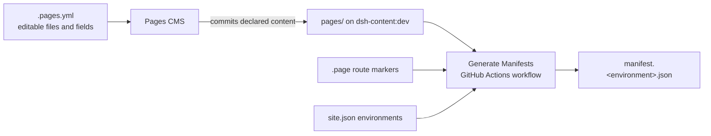
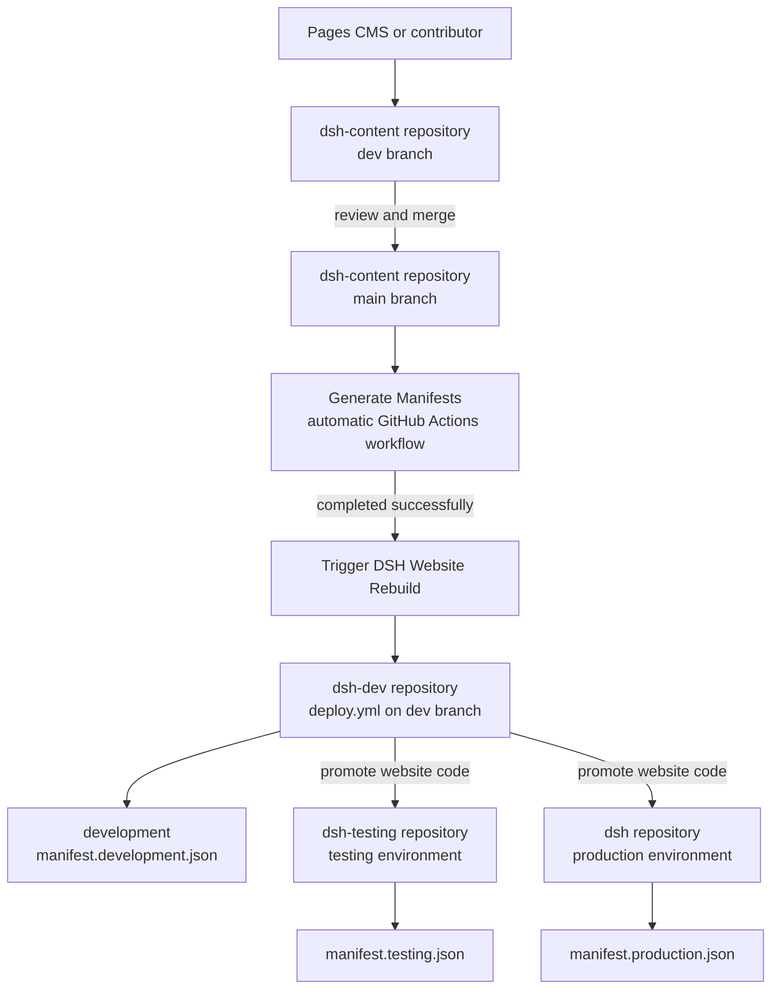

# dsh-content

`dsh-content` is the content repository for the Digital Solutions Hub websites (`dsh`, `dsh-dev`, and `dsh-testing`). It stores the content files, controls which content can be edited through Pages CMS, and publishes environment-specific manifests that the website repositories use during their builds.

The expected workflow is as follows:

1. Edit content on the `dev` branch, usually through Pages CMS.
2. Review the change and merge the `dev` branch into the `main` branch.
3. The [Generate Manifests GitHub Actions workflow](.github/workflows/generate-manifests.yml) automatically generates and commits the environment manifests in `main`.
4. After manifest generation succeeds, the [Trigger DSH Website Rebuild workflow](.github/workflows/trigger-dsh-website-rebuild.yml) requests a rebuild of the [`dsh-dev` repository](https://github.com/NERC-Digital-Solutions-Hub/dsh-dev).

You should not edit or commit generated manifests manually.

## How the repository fits together

Pages CMS and the manifests the following responsibilities:

- [`pages/`](pages/) contains the content consumed by the websites.
- [`.pages.yml`](.pages.yml) controls which files and fields Pages CMS exposes for editing.
- [`.page`](pages/.page) marker files identify the directories that become manifest routes.
- [`site.json`](site.json) declares the environments for which manifests are generated.
- The [Generate Manifests workflow](.github/workflows/generate-manifests.yml) turns the content under `pages/` into environment-specific mappings.



## Editing content with Pages CMS

Pages CMS wraps around this repository and uses `.pages.yml` to build its editing interface. The configuration contains:

- `group` entries that organise the CMS navigation.
- `file` entries for fixed content or configuration files.
- `collection` entries for repeatable content such as research articles.
- Field definitions that control the form presented to an editor.
- A `media` configuration that stores uploaded images under `pages/images`.

Only declared files and collections are editable through the CMS. See the [Pages CMS configuration documentation](https://pagescms.org/docs/configuration/) when adding or changing entries in `.pages.yml`.

Pages CMS is configured to commit changes to the `dev` branch. Saving in the CMS updates `dsh-content:dev`; it does not immediately publish the change. The resulting commit must still be reviewed and merged into `main`.

### Example: add a research article

The `research-articles` collection in `.pages.yml` maps to:

```text
pages/research/articles/{slug}.md
```

To add an article through Pages CMS:

1. Open **Research → Research Articles**.
2. Create an item and choose its slug. The slug becomes the Markdown filename.
3. Enter the title and any optional description, thumbnail, date, tags, or hidden status.
4. Add the article body using the rich-text Markdown editor.
5. Save the item. Pages CMS commits it to the `dev` branch of this repository.
6. Review the content and merge `dev` into `main`.

The resulting file follows this shape:

```markdown
---
title: Example research article
description: A short summary of the article.
thumbnail: pages/images/example.png
date: 2026-07-21
tags:
  - Research
hidden: false
---

# Example research article

Article content goes here.
```

Because `pages/research/articles/.page` exists, the article is included under the `articles` manifest page at `/research/articles`. A file named `example-research-article.md` has the asset key `example-research-article`.

A Markdown file added directly to this collection on `dev` also becomes editable in Pages CMS when its frontmatter matches the configured fields.

### Example: expose a configuration file in Pages CMS

Configuration files are represented by fixed `file` entries in the CMS. Each environment is declared separately so an editor can deliberately choose **Default**, **Development**, **Testing**, or **Production** in the CMS.

For example, this entry exposes the testing site settings file:

```yaml
- name: home-settings-testing
  label: Testing
  type: file
  path: pages/settings/settings.testing.json
  format: json
  operations:
    create: true
    rename: false
    delete: false
  fields:
    - name: enableIntroductionPopup
      label: Enable Introduction Popup
      type: boolean
```

To add a configuration to the CMS:

1. Choose the configuration path and, where applicable, its environment suffix.
2. Add a `file` entry under the appropriate group in `.pages.yml`.
3. Set the file format and declare fields that match the JSON structure.
4. Use `operations.create: true` when Pages CMS should be able to create the fixed file if it does not exist.
5. Commit the `.pages.yml` change to `dev`.
6. Open the new entry in Pages CMS, create or edit its values, and save the CMS commit to `dev`.
7. Review and merge `dev` into `main`.

The example above produces configuration such as:

```json
{
	"enableIntroductionPopup": true
}
```

Because `pages/.page` defines the root route, `pages/settings/settings.testing.json` is included in the testing manifest under the `home` page with the asset key `settings.settings`.

When adding any other CMS-managed content type, use a `file` entry for a fixed file or a `collection` entry for repeatable items. Add a `.page` marker only when a directory should become a separate manifest route.

## Publishing and website rebuilds

Merging `dsh-content:dev` into `dsh-content:main` starts the automated publishing process.

### Generate Manifests

The [Generate Manifests GitHub Actions workflow](.github/workflows/generate-manifests.yml):

1. Checks out the content from `main`.
2. Reads the environments declared in `site.json`.
3. Finds the routes identified by `.page` markers.
4. Maps each route's files to stable asset keys.
5. Applies default and environment-specific file selection.
6. Writes `manifest.development.json`, `manifest.testing.json`, and `manifest.production.json`.
7. Automatically commits changed manifests to `main`.

The workflow also runs after the UPRN configuration build completes successfully, ensuring generated UPRN assets can be included in the manifests.

### Trigger the development website rebuild

The [Trigger DSH Website Rebuild workflow](.github/workflows/trigger-dsh-website-rebuild.yml) waits for Generate Manifests to complete successfully. It then dispatches `deploy.yml` on the `dev` branch of the separate [`NERC-Digital-Solutions-Hub/dsh-dev` repository](https://github.com/NERC-Digital-Solutions-Hub/dsh-dev).

A failed or incomplete Generate Manifests run does not rebuild the development website.



### Website repositories and environments

Each website repository selects its content manifest at build time from its configured `PUBLIC_DSH_ENVIRONMENT` value:

| Website repository                                                         | Environment value | Manifest                    |
| -------------------------------------------------------------------------- | ----------------- | --------------------------- |
| [`dsh-dev`](https://github.com/NERC-Digital-Solutions-Hub/dsh-dev)         | `development`     | `manifest.development.json` |
| [`dsh-testing`](https://github.com/NERC-Digital-Solutions-Hub/dsh-testing) | `testing`         | `manifest.testing.json`     |
| [`dsh`](https://github.com/NERC-Digital-Solutions-Hub/dsh)                 | `production`      | `manifest.production.json`  |

When website code is merged from the `dsh-dev` repository into the `dsh-testing` or `dsh` repository, the target repository rebuilds using its own configured environment. This allows all three websites to use the same content repository while resolving different environment-specific files.

## Manifest purpose and structure

A manifest is a machine-readable mapping between stable page and asset identifiers and the physical files under `pages/`. Website repositories use this mapping instead of hardcoding content paths.

Each manifest contains:

- `schemaVersion`: the manifest schema version.
- `version` and `generatedAt`: the UTC generation timestamp.
- `environment`: the environment represented by the manifest.
- `pages`: an object keyed by stable page ID.
- `route`: the website route represented by a page.
- `assets`: flat asset keys mapped to file descriptors.

Example:

```json
{
	"schemaVersion": 1,
	"version": "2026-07-21T10:30:00Z",
	"generatedAt": "2026-07-21T10:30:00Z",
	"environment": "production",
	"pages": {
		"home": {
			"route": "/",
			"assets": {
				"settings.settings": {
					"path": "settings/settings.production.json",
					"type": "json"
				}
			}
		}
	}
}
```

## Page routes and IDs

A directory becomes a manifest route only when it contains a `.page` marker.

```text
pages/
  .page
  research/
    .page
    main.md
    articles/
      .page
      example-research-article.md
```

This produces the routes `/`, `/research`, and `/research/articles`.

Files beneath a nested route are not included in the parent route. In the example above, article files belong to `/research/articles`, not `/research` or `/`.

### Page IDs

An empty `.page` file uses the final route segment as its page ID:

| Route                | Default page ID |
| -------------------- | --------------- |
| `/`                  | `home`          |
| `/research`          | `research`      |
| `/research/articles` | `articles`      |
| `/apps/uprn-service` | `uprn-service`  |

A `.page` file can contain JSON to provide an explicit ID:

```json
{
	"id": "uprn-service"
}
```

Use explicit IDs when the route and stable application identifier should differ, or when default IDs would collide. Duplicate page IDs cause the Generate Manifests workflow to fail.

A page is omitted from a particular environment's manifest when it has no applicable assets for that environment.

## Assets and asset keys

Each asset is described by its path relative to `pages/` and its inferred content type:

```json
{
	"path": "research/main.md",
	"type": "markdown"
}
```

Asset keys are derived from the path beneath the route directory:

1. Remove a recognised environment segment from the filename.
2. Remove the file extension.
3. Convert each directory and filename segment to lowercase kebab-case.
4. Join the segments with `.`.

Examples:

| Route-relative file                        | Asset key                       |
| ------------------------------------------ | ------------------------------- |
| `introduction/introduction.development.md` | `introduction.introduction`     |
| `settings/settings.testing.json`           | `settings.settings`             |
| `CJ_Backend.xlsx`                          | `cj-backend`                    |
| `generated/csv/config/datasets.csv`        | `generated.csv.config.datasets` |
| `svgs/bootstrap/info-circle.svg`           | `svgs.bootstrap.info-circle`    |

Hidden files and `.page` markers are not emitted as assets. Avoid files in the same route whose paths normalise to the same asset key, such as `image.jpg` and `image.png`.

### Asset types

Types are inferred from file extensions. Common mappings include:

| Extensions      | Manifest type |
| --------------- | ------------- |
| `.md`, `.mdx`   | `markdown`    |
| `.json`         | `json`        |
| `.csv`          | `csv`         |
| `.svg`          | `svg`         |
| `.png`          | `png`         |
| `.jpg`, `.jpeg` | `jpg`         |
| `.gif`          | `gif`         |
| `.webp`         | `webp`        |
| `.xlsx`, `.xls` | `xlsx`, `xls` |
| `.txt`          | `text`        |
| `.html`         | `html`        |
| `.xml`          | `xml`         |
| `.pdf`          | `pdf`         |

Unknown extensions use the extension as the type. A file without an extension uses `binary`.

## Environment-specific content

[`site.json`](site.json) currently declares three environments:

```json
{
	"environments": ["production", "development", "testing"]
}
```

The Generate Manifests workflow writes one manifest for each value.

A filename is environment-specific when it follows:

```text
<name>.<environment>.<extension>
```

For example:

```text
settings/settings.json
settings/settings.development.json
settings/settings.testing.json
settings/settings.production.json
```

All of these files map to the `settings.settings` asset key:

- An environment-specific file overrides the default file for its matching environment.
- The default file is used when there is no matching override.
- An environment-specific file without a default is included only in its matching environment.

| Manifest                    | Selected path                        |
| --------------------------- | ------------------------------------ |
| `manifest.development.json` | `settings/settings.development.json` |
| `manifest.testing.json`     | `settings/settings.testing.json`     |
| `manifest.production.json`  | `settings/settings.production.json`  |

Generated manifests should not be edited manually. They are maintained automatically by the Generate Manifests workflow after content reaches `main`.

## How website repositories consume content

A website selects the manifest matching its configured environment, finds a page by its stable ID or route, and resolves assets by their stable keys.

For example, website code can read the root settings without knowing which environment-specific file was selected:

```ts
const source = createContentSource({
	environment: process.env.PUBLIC_DSH_ENVIRONMENT,
});

const page = await source.getPage('/');
const settings = await source.readJson(page, 'settings.settings');
```

This keeps website code independent of environment suffixes and the physical content directory layout, provided page IDs, routes, and asset keys remain stable.
