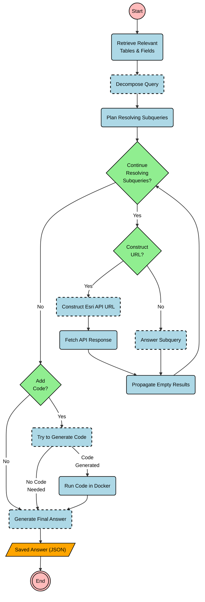

# AI Agents for Geospatial Data

Finding specific information within large geospatial datasets can be complex and time-consuming. To simplify this, we have developed a project using AI agents to interact directly with the Esri REST API for [ClimateJust](https://climatejust.org.uk) data.

This work explores how an AI-powered chatbot can answer user questions by intelligently querying a data API.

## An AI Chatbot for ClimateJust Data

We built a chatbot that understands natural language questions about ClimateJust data. Instead of requiring users to write complicated API queries, the chatbot does the hard work for them. It breaks down a question, figures out how to get the answer from the Esri API, and may even write and execute small pieces of code to process the data.

This approach allows for a more intuitive and powerful way to explore complex datasets. The system plans and executes multiple steps to retrieve and synthesize information, delivering a final answer directly to the user.

The diagram below outlines the decision-making process the AI agent follows to answer a query.

This project demonstrates the power of AI agents to act as intelligent assistants, making complex data sources more accessible to a wider audience.
