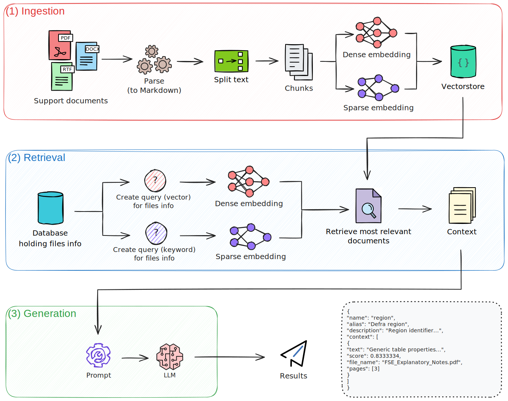
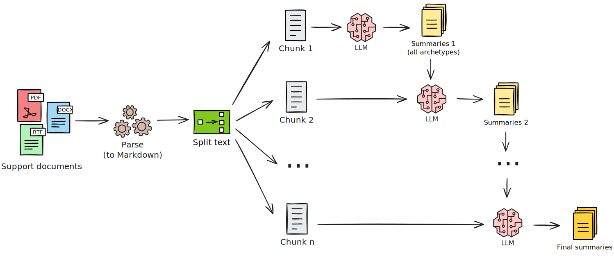

# AI-Powered Document Insights

Navigating large volumes of documentation can be a significant challenge. To address this, we've developed an AI-powered system that processes and analyzes a collection of publicly available support documents, making the information within them easier to access and understand.

Our work demonstrates two key AI capabilities: answering complex questions and summarizing lengthy documents.

## Answering Questions with RAG

We have implemented a technique called Retrieval Augmented Generation (RAG) to build a question-answering system. After downloading and processing a corpus of documents, our system can answer questions by first searching these documents for the most relevant information. It then uses that specific context to generate a precise and trustworthy answer, ensuring the information is grounded in the source material.

## Summarizing a Mountain of Documents

To tackle long and complex documents, we built a summarization tool that uses AI to produce clear and concise summaries. The system has been designed to effectively read through lengthy material and extract the key points, generating a summary that captures the main ideas of the original document.

Through this project, we have shown how AI can make a large body of public knowledge more accessible and easier to understand for everyone.
